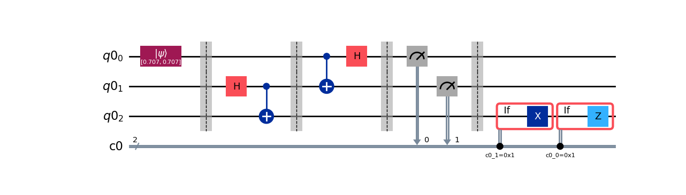
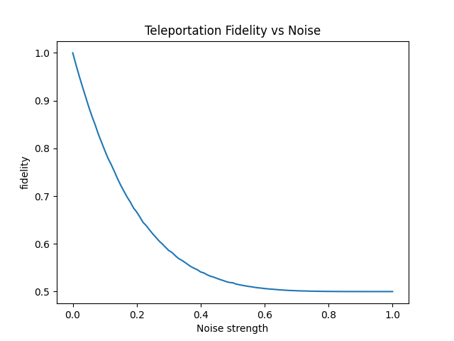

# Analysis-of-Fidelity-in-Quantum-teleportaition-under-Noise
This project simulates the Quantum teleportation protocol in Qiskit and analyses the degradation of its performance with the increase in noise.

## Built With

This project was made in python and uses the libraries:
- Qiskit
- Qiskit_Aer
- matplotlib

## Getting Started

To get this project up and running follow the following steps.
### Prerequisites
Libraries needed to run this project:

- Qiskit
```
pip install qiskit
```
- Qiskit_Aer
```
pip install qiskit-aer
```
- matplotlib
```
pip install matplotlib
```

## Key Concepts

- Quantum Teleportation
- Entanglement and Bell States
- Density Matrix Formalism
- Quantum Noise Models (Depolarizing Noise)
- Quantum State Fidelity

## Circuit Diagram
This is the visualization of the circuit via Matplotlib


## Features

- Implementation of the quantum teleportation protocol.
- Simulation of realistic quantum noise using a depolarizing model.
- Fidelity analysis using density matrix.
- Visualization of how teleportation performance degrades with noise.

## Results

The fidelity of teleportation decreases as noise increases, demonstrating the sensitivity of quantum information to decoherence.



## License

This project is licensed under the MIT License.
